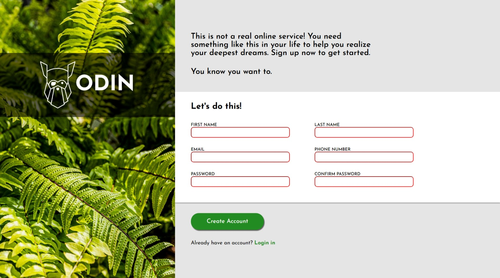
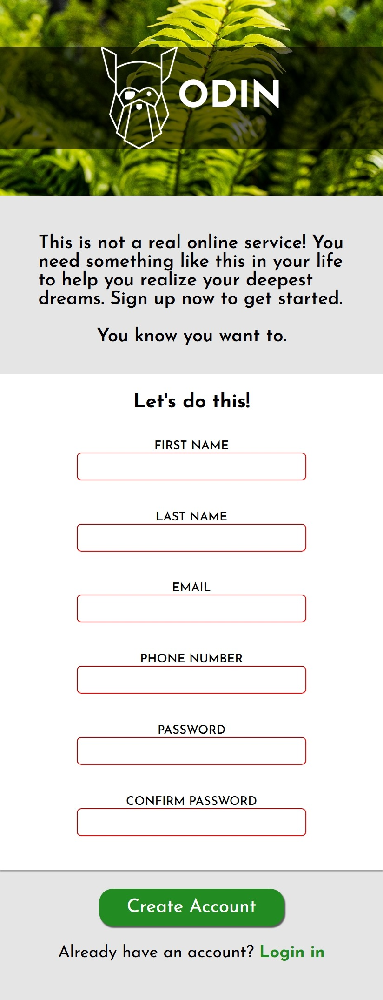

# 🧾 The First Odin Project: Sign-Up Form

This is my first completed project from [The Odin Project](https://www.theodinproject.com/lessons/node-path-intermediate-html-and-css-sign-up-form), focused on building a modern, responsive sign-up form using only HTML and CSS.

## 📌 Project Goal

Create a registration page that simulates a real-world service, applying best practices in structure, responsiveness, and visual design. The project includes:

- Input fields for name, email, and password
- Responsive layout using Flexbox
- Custom styling with fonts and spacing
- Clear visual hierarchy and basic accessibility

## 🚀 Getting Started

1. Clone the repository:
   ```bash
   git clone https://github.com/fargila/The-Second-Odin-Project-Admin-Dashboard.git

## 🖼️ Previews

### 💻 Desktop Version


### 📱 Mobile Version



## 🛠️ Technologies Used

- HTML5
- CSS3 (Flexbox, Media Queries)
- Google Fonts: *Josefin Sans*

## 🙌 Acknowledgments

Thanks to [The Odin Project](https://www.theodinproject.com/) for providing this learning path. This project was a great introduction web development for me.

And also to [Emils Nemse](https://unsplash.com/pt-br/@ejn) for providing the background image from [Unsplash.com](https://unsplash.com/) :^)

---

Feel free to explore, clone, or suggest improvements!
